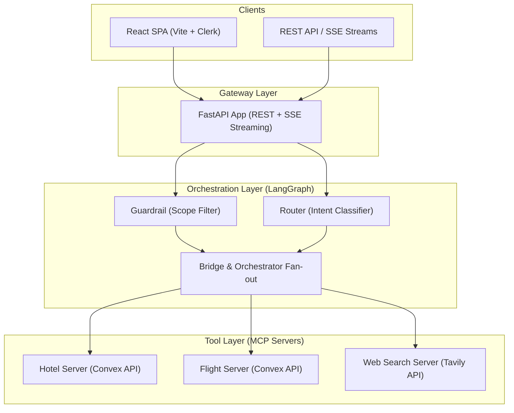
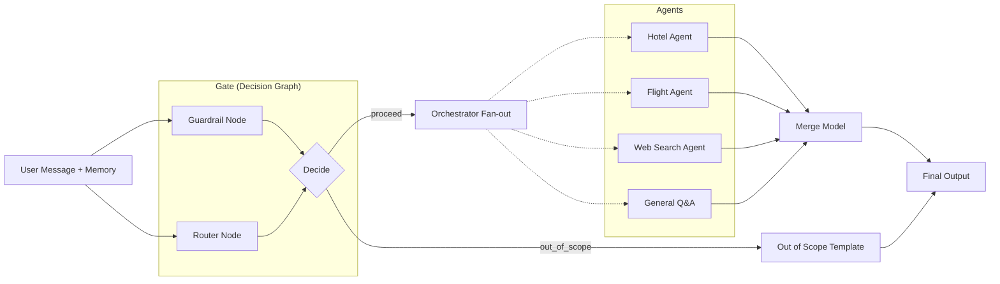

<p align="center">
  
  
  
  
  
</p>

# BookMe AI

> **MCP-based multi-agent travel assistant powered by a parallel decision graph, LangGraph orchestrator, and real-time streaming API.**

BookMe AI is an intelligent travel planning system built on a modern AI architecture. It orchestrates multiple specialized AI agents through a LangGraph state machine to handle hotel bookings, flight searches, and general travel inquiries. By utilizing the Model Context Protocol (MCP) and a parallel guardrail/router decision graph, BookMe AI delivers robust, scalable, and secure AI interactions.

---

## Table of Contents

- [Key Features](#-key-features)
- [System Architecture](#-system-architecture)
- [Agent Pipeline](#-agent-pipeline)
- [Memory System](#-memory-system)
- [Retrieval Strategies](#-retrieval-strategies)
- [Voice Pipeline](#-voice-pipeline)
- [MCP Servers (Tool Layer)](#-mcp-servers-tool-layer)
- [Tech Stack](#-tech-stack)
- [Project Structure](#-project-structure)
- [Getting Started](#-getting-started)
- [AWS Deployment](#-aws-deployment)
- [CI/CD Pipeline](#-cicd-pipeline)
- [Configuration](#-configuration)
- [API Reference](#-api-reference)
- [Observability](#-observability)
- [License](#-license)

---

## ✨ Key Features

| Feature | Description |
|---|---|
| **Multi-Agent Orchestrator** | LangGraph fan-out to specialized agents (Hotel, Flight, Web Search, General Q&A) to handle diverse user queries concurrently. |
| **Guardrail System** | Parallel LangGraph sub-graph that runs scope-filtering and routing simultaneously, rejecting out-of-scope non-travel queries instantly. |
| **Model Context Protocol (MCP)** | Standardized tool access via MCP stdio servers, decoupling LLM nodes from raw HTTP clients for external integrations (Convex, Tavily). |
| **Streaming API** | Server-Sent Events (SSE): chain-of-thought stages, MCP tool progress, and **LLM token deltas** on the final answer. See [docs/STREAMING.md](docs/STREAMING.md). |
| **Multi-Provider LLMs** | Unified and configurable access to OpenAI and Google models via YAML settings, featuring fallback configurations. |
| **Observability** | End-to-end tracing with LangFuse — prompt management, cost tracking, and detailed span analysis without needing a redeploy. |
| **Secure Authentication** | Integration with Clerk for secure JWT-based API access (easily toggleable for local development). |

---

## 🏗️ System Architecture

### High-Level Overview



---

## 🤖 Agent Pipeline

The core orchestration relies on a dual-state LangGraph implementation:


| Layer | Role | What It Does |
|---|---|---|
| **Gate (Decision Graph)** | Scope & Intent | Evaluates `in_scope` vs `out_of_scope`. If valid, routes to appropriate actions (`hotel`, `flight`, `web_search`, `general_qa`). Guardrail and routing happen in parallel for zero added latency. |
| **Orchestrator** | Agent Execution | Takes the routed decisions and fans out to specialized MCP-backed agents. Combines their results using a merge model. |
| **Agents** | Tool usage | The Hotel agent fetches accommodations, the Flight agent books flights, and the Web Search agent handles live queries (e.g., tourist spots). |

---

## 🧠 Memory System

BookMe AI relies on an efficient, thread-safe memory architecture:

- **SessionStore**: Context is isolated by `(user_id, session_id)` ensuring complete privacy between concurrent users.
- **Configurable Context**: Controlled by `config/params.yaml`, the system dictates `max_turns` and `history_window` to stay well within token limits.

*(Note: Advanced Long-Term/Procedural memory systems like Vector DBs are currently **Under Development** for future phases).*

---

## 🔍 Retrieval Strategies

| Strategy | Description | Use Case |
|---|---|---|
| **API Tool Calling** | Direct REST lookup via MCP servers to live data (Convex). | Live flight availability, hotel searching/booking |
| **Web Search** | Live web scraping and indexing using Tavily. | Exploring tourist spots, weather, or real-time events |

---

## 🎙️ Voice Pipeline

*This feature is currently **Under Development**.*
Future iterations will introduce a LiveKit-powered real-time voice pipeline for hands-free travel orchestration.

---

## 🔧 MCP Servers (Tool Layer)

The agent's tools are securely exposed via **Model Context Protocol (MCP)** stdio servers:

| MCP Server | Tools | Backend |
|---|---|---|
| **Hotel Server** | `list_hotels`, `search_hotels`, `book_hotel` | Convex HTTP endpoint |
| **Flight Server** | `list_flights`, `search_flights`, `book_flight` | Convex HTTP endpoint |
| **Web Search Server** | `search` | Tavily API |

---

## 🛠️ Tech Stack

### Backend
| Component | Technology |
|---|---|
| Framework | **FastAPI** (async, ASGI, SSE) |
| Agent Orchestration | **LangGraph** & **LangChain** |
| Tool Standard | **MCP** (`langchain-mcp-adapters`) |
| Observability | **LangFuse** (tracing, prompt management) |
| HTTP Clients | **httpx**, **requests**, **tenacity** (retries) |

### Frontend
| Component | Technology |
|---|---|
| Framework | **React 19** + **TypeScript** |
| Build Tool | **Vite** |
| Authentication | **Clerk** (JWT tokens) |

---

## 📁 Project Structure

```
BookMe AI/
│
├── src/                          # Backend source code
│   ├── agents/                   # 🤖 Agent orchestration layer
│   │   ├── chat_pipeline.py      #    Main entry for chat turn
│   │   ├── decision_graph.py     #    Parallel guardrail + router sub-graph
│   │   ├── orchestrator.py       #    Agent fan-out logic
│   │   ├── router.py             #    Intent query classifier
│   │   ├── state.py              #    AgentState TypedDict
│   │   ├── prompts/              #    LangFuse-managed prompt integration
│   │   └── tools/                #    Internal tools (HTTP implementations)
│   │
│   ├── api/                      # 🌐 FastAPI application
│   │   ├── main.py               #    App factory, lifespan
│   │   ├── middleware.py         #    CORS, Auth
│   │   ├── schemas.py            #    Pydantic models
│   │   └── routers/              #    API endpoints (chat.py, etc.)
│   │
│   ├── mcp_servers/              # 🔌 Model Context Protocol servers
│   │   ├── flight_server.py      #    Flight MCP interface
│   │   ├── hotel_server.py       #    Hotel MCP interface
│   │   ├── mcp_config.py         #    Server orchestration
│   │   └── web_search_server.py  #    Tavily MCP interface
│   │
│   └── infrastructure/           # 🏗️ Infrastructure layer
│       ├── config.py             #    YAML config loader
│       ├── llm.py                #    LLM provider factory
│       ├── log.py                #    Loguru setup
│       ├── observability.py      #    LangFuse integration
│       └── session_store.py      #    In-memory chat state
│
├── frontend/                     # 💻 React frontend (Vite)
│   └── src/                      #    React components & UI
│
├── config/                       # ⚙️ Configuration files
│   ├── params.yaml               #    System parameters (context, API URLs)
│   └── models.yaml               #    LLM configurations
│
├── docs/                         # 📚 Architecture and setup documentation
├── Makefile                      # 🛠️ Task runner (tests, run commands)
└── requirements.txt              #    Python dependencies
```

---

## 🚀 Getting Started

Run all `make` commands from the **repository root** (`BookMe AI/`).

### Prerequisites

| Tool | Version |
|------|---------|
| Python | 3.11+ |
| Node.js | 18+ (npm) |
| Make | GNU Make or BSD make |
| Docker | Optional — for `make docker-up` |

Hotel and flight tools call the Convex URLs in `config/params.yaml` (no separate Convex setup for local dev).

---

### Option A — Native dev (recommended)

Best for day-to-day work: hot-reload API + Vite dev server.

#### 1. One-time install

```bash
git clone <your-repo-url> "BookMe AI"
cd "BookMe AI"
make setup
```

`make setup` creates `.venv`, installs `requirements.txt`, and runs `npm install` in `frontend/`.

#### 2. Environment files

**API** — copy and edit the repo root env:

```bash
cp .env.example .env
```

Minimum keys for a working chat:

| Variable | Required | Notes |
|----------|----------|--------|
| `OPENAI_API_KEY` | Yes | Router, guardrail, agents |
| `TAVILY_API_KEY` | Yes | Web search MCP (`tourist spots`, etc.) |
| `GOOGLE_API_KEY` | Recommended | Multi-agent merge model in `config/models.yaml` |

**Frontend** — copy and edit:

```bash
cp frontend/.env.example frontend/.env
```

Keep `VITE_API_URL=http://127.0.0.1:8000` (Vite proxies browser requests from `/api/*` to this host).

#### 3. Auth mode (pick one)

**Local dev without Clerk** (fastest — no sign-in):

Root `.env`:

```bash
AUTH_DISABLED=1
# optional: DEV_USER_ID=dev-user
```

`frontend/.env`:

```bash
VITE_AUTH_DISABLED=true
# optional: VITE_DEV_USER_ID=dev-user
```

**Production-style Clerk** (sign-in on localhost):

Root `.env`: `AUTH_DISABLED=0`, `CLERK_SECRET_KEY=sk_test_…`, and origins including `http://localhost:5173` in `CLERK_AUTHORIZED_PARTIES` and `CORS_ORIGINS`.

`frontend/.env`: `VITE_AUTH_DISABLED=false`, `VITE_CLERK_PUBLISHABLE_KEY=pk_test_…`.

Full checklist: [docs/CLERK_SETUP.md](docs/CLERK_SETUP.md). After editing env, run `make check-clerk` when Clerk is enabled.

#### 4. Run (two terminals)

**Terminal 1 — API**

```bash
source .venv/bin/activate   # Windows: .venv\Scripts\activate
make run-api
```

- API: http://127.0.0.1:8000  
- OpenAPI: http://127.0.0.1:8000/docs  
- Readiness (MCP tools): http://127.0.0.1:8000/ready  

**Terminal 2 — UI**

```bash
make run-ui
```

- App: http://127.0.0.1:5173  
- Chat: http://127.0.0.1:5173/app  

#### 5. Smoke test

```bash
make check-config
curl -fsS http://127.0.0.1:8000/health
curl -N http://127.0.0.1:8000/chat/stream \
  -H "Content-Type: application/json" \
  -d '{"session_id":"demo-1","user_id":"dev-user","message":"tourist spots in London"}'
```

(With `AUTH_DISABLED=1`, `user_id` in the JSON body is used; with Clerk, use the signed-in UI instead.)

---

### Option B — Docker Compose (API + nginx UI)

Single command stack; UI on port **8080** with `/api` proxied to the API container.

#### 1. Root `.env`

Same API keys as Option A. Docker build reads these from `.env`:

- **No Clerk:** `AUTH_DISABLED=1` and `VITE_AUTH_DISABLED=true`
- **With Clerk:** `AUTH_DISABLED=0`, `CLERK_SECRET_KEY`, and `VITE_CLERK_PUBLISHABLE_KEY=pk_test_…` (baked into the web image at build time)

Optional image namespace:

```bash
export DOCKER_REGISTRY_USER=your_dockerhub_username   # default tag prefix: bookme/*
```

#### 2. Start stack

```bash
make docker-up
```

- UI: http://localhost:8080 (chat at `/app`)  
- API (direct): http://localhost:8000  

Stop: `make docker-down`.

Images: `docker/api/Dockerfile`, `docker/web/Dockerfile`. Production pull-only: `compose.prod.yaml`.

---

### Makefile reference

| Command | Purpose |
|---------|---------|
| `make setup` | One-time `.venv` + Python deps + `frontend` npm install |
| `make install` | Re-install Python deps (uses `.venv/bin/pip` when present) |
| `make install-ui` | `npm install` in `frontend/` only |
| `make run-api` | FastAPI with reload on `:8000` |
| `make run-ui` | Vite dev server on `:5173` |
| `make docker-up` | `docker compose up -d --build` |
| `make check-config` | Validate provider keys vs `config/models.yaml` |
| `make check-clerk` | Validate Clerk env when `AUTH_DISABLED=0` |

Run `make` or `make help` for tests, MCP inspectors, and LangFuse seeding.

---

## ☁️ Deployment

| API | UI | Doc |
|-----|-----|-----|
| Render (free tier) | Vercel | [DEPLOY_RENDER_VERCEL.md](docs/DEPLOY_RENDER_VERCEL.md) |
| **DigitalOcean** Droplet | Vercel | [DEPLOY_DO_VERCEL.md](docs/DEPLOY_DO_VERCEL.md) — **API first:** [DEPLOY_DO_API.md](docs/DEPLOY_DO_API.md) |

Docker Compose locally or full stack on one VM: `make docker-up`, `compose.prod.yaml`. API-only on a droplet: `compose.prod.api.yaml`.

---

## 🔄 CI/CD Pipeline

Optional: `.github/workflows/docker-publish.yml` pushes the API image to Docker Hub and auto-deploys to a DigitalOcean droplet (see [docs/DEPLOY_DO_API.md](docs/DEPLOY_DO_API.md)). **Vercel** deploys the frontend separately from Git.

---

## ⚙️ Configuration

Runtime behavior is easily controlled via YAML:

### `config/params.yaml`
- Service URLs (Convex base endpoints).
- Session memory configurations (max turns, window size).
- Observability and prompt cache TTL settings.

### `config/models.yaml`
- Maps roles (router, guardrail, chat) to specific LLM models (e.g., `gpt-4o-mini`).
- Temperature and fallback controls.

---

## 📡 API Reference

| Endpoint | Method | Description |
|---|---|---|
| `/health` | `GET` | API Liveness check |
| `/ready` | `GET` | Config + MCP tool readiness check |
| `/config` | `GET` | Active models list (non-secret) |
| `/chat/reset` | `POST` | Clear session memory for `(user_id, session_id)` |
| `/chat` | `POST` | Standard blocking chat turn |
| `/chat/stream`| `POST` | Server-Sent Events (SSE) streaming chat turn |

You can test chat locally via curl:
```bash
curl -N http://127.0.0.1:8000/chat/stream \
  -H "Content-Type: application/json" \
  -d '{"session_id":"demo-1","user_id":"dev-user","message":"tourist spots in London"}'
```

---

## 📊 Observability

BookMe AI uses **LangFuse** (`@observe`) for comprehensive observability:
- **Prompt Management:** System prompts are fetched from LangFuse (or local fallbacks) to allow hot-editing without redeploys.
- **Tracing:** Complete span visibility across the decision graph and MCP agent fan-out.
- **Token Tracking:** Usage tracked for every LLM interaction.

---

## 📄 License

This project is proprietary software. All rights reserved.

---

<p align="center">
  Built with ❤️
</p>
