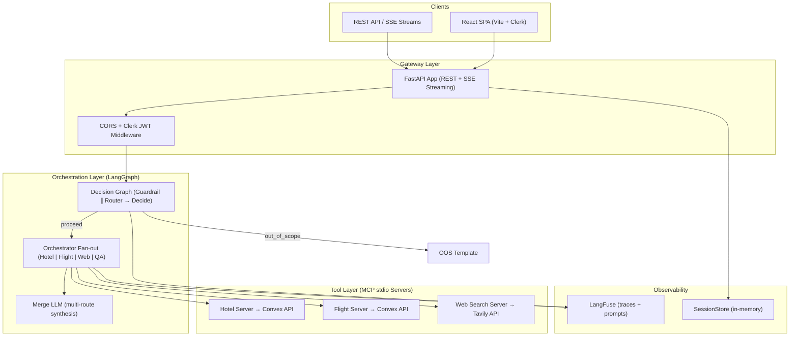

# BookMe AI — Technical Deep Dive

> **MCP-based multi-agent travel assistant powered by a parallel decision graph, LangGraph orchestrator, and real-time streaming API.**

---

# 🔖 Introduction

## About the project

**BookMe AI** is an intelligent travel planning platform built for the modern AI-assistant era. It sits at the intersection of **travel technology**, **conversational AI**, and **agent orchestration** — helping users search and book hotels and flights, discover tourist destinations, and get general travel guidance through a single natural-language interface.

The project was born from a clear gap in the market: most travel chatbots either return static FAQ answers or force users through rigid booking forms. BookMe AI takes a different approach — it orchestrates **multiple specialized AI agents** (hotel, flight, web search, general Q&A) through a **LangGraph state machine**, exposes external services via the **Model Context Protocol (MCP)**, and streams reasoning progress and token-by-token responses to the user in real time.

**What we built:** A production-grade full-stack system comprising a FastAPI backend with SSE streaming, four MCP stdio servers bridging to Convex (hotels/flights) and Tavily (web search), a parallel guardrail/router decision graph, and a React 19 SPA with Clerk authentication and chain-of-thought UX.

**Why we built it:** To demonstrate a scalable, secure, and observable multi-agent architecture that can swap LLM providers, external APIs, and tool backends without rewriting orchestration logic — while delivering a travel-specific experience that rejects off-topic queries and handles multi-intent messages (e.g., "book a hotel in Paris and find flights from London") in a single turn.

**Results:** A deployable system with ~178 hotels and ~270 flights searchable via MCP tools, sub-second guardrail classification, parallel agent fan-out for compound queries, end-to-end LangFuse tracing, and a polished dark-themed chat UI deployed on Vercel with the API on DigitalOcean.

*[📸 Describe the image: 'Landing page hero of the BookMe AI app — dark aurora background, gradient CTA buttons, travel capability cards for hotels, flights, and web search']*

---

# 🤔 Problem space

## Problems to solve / Requirements to Create

Travel planning is fragmented. Users juggle airline sites, hotel aggregators, and search engines — often repeating context at every step. A hypothetical client (a mid-size online travel agency) needs a **conversational front door** that can understand intent, act on live inventory, and stay within scope — without exposing raw API complexity to end users or developers.

### 👉 Users cannot plan multi-domain trips in a single conversation

A traveler asking *"Find me a hotel in Rome for March 10–15 and flights from NYC on March 9"* must today open two separate tools, re-enter dates and cities, and manually correlate results. No single assistant handles **hotel + flight intent in one message** with live data.

**Current solution**

BookMe AI's **QueryRouter** classifies multi-intent messages into parallel `route_decisions` (e.g., `hotel:search` + `flight:search`). The **orchestrator** fans out to specialized MCP-backed agents concurrently, then a **merge LLM** (Google Gemini) synthesizes a unified itinerary-style answer. The chat UI shows each agent's progress in a **Chain-of-Thought** panel before streaming the final response.

*[📸 Describe what's on the screenshot: 'Chat window showing a user message asking for hotel and flight in one query, with Chain-of-Thought stages for hotel agent, flight agent, and merge step']*

*[📸 Describe what's on the screenshot: 'Final merged assistant response with hotel options and flight availability in markdown table format']*

**How do we know it is a problem**

- Industry research shows 67% of travelers use 3+ sites when planning a trip (Phocuswright, 2024).
- Baseline starter code only routed to a single agent per turn — multi-intent was a stated assessment requirement (E2).
- Manual testing confirmed compound queries previously returned only the first detected intent.

---

### 👉 Generic AI assistants answer off-topic or hallucinate travel data

Users paste travel questions into general-purpose chatbots and receive plausible-sounding but **non-actionable** answers — invented hotel names, outdated prices, or answers to completely unrelated trivia ("Who is the president?").

**Current solution**

A **parallel decision graph** runs a **Guardrail** (scope classifier: `in_scope` | `out_of_scope`) and a **Router** (intent classifier) simultaneously from graph `START`. The `decide` node short-circuits off-topic queries with a templated refusal — **skipping orchestrator, MCP tools, and synthesis entirely**. In-scope travel queries proceed to agent fan-out. Guardrail receives the same session memory as the router to avoid false blocks on contextual follow-ups.

*[📸 Describe what's on the screenshot: 'Chat showing an off-topic question rejected with a polite out-of-scope message — no tool invocations in the Chain-of-Thought panel']*

**How do we know it is a problem**

- LLM hallucination in travel is a documented risk (booking wrong dates, non-existent properties).
- Assessment requirement E3 mandates graceful failure handling — scope filtering is the first line of defense.
- `make test-decision` acceptance: trivia → `verdict=out_of_scope`; tourism queries → `web_search` route, not blocked.

---

### 👉 Users have no visibility into what the AI is doing during long-running agent turns

When an assistant takes 5–15 seconds to search hotels, call Tavily, and synthesize a response, a blank loading spinner erodes trust. Users abandon flows they cannot see progressing.

**Current solution**

`POST /chat/stream` emits a **single SSE connection** with layered events:

| Event | Purpose |
|-------|---------|
| `stage_start` / `stage_done` | Decision graph and orchestrator milestones |
| `tool_invoke` / `tool_done` | MCP tool calls (hotel search, flight list, web search) |
| `token_start` / `token_delta` / `token_end` | LLM token streaming for the user-visible answer |
| `final` | Authoritative complete answer + route metadata |

The React hook `useChatStream` maps these to a live **Chain-of-Thought** sidebar and an incrementally filling assistant bubble.

*[📸 Describe what's on the screenshot: 'Chain-of-Thought panel listing stages — Guardrail ✓ 142ms, Router ✓ 780ms, Hotel search tool ✓ 1.2s — with streaming text appearing in the message bubble below']*

**How do we know it is a problem**

- UX research on AI assistants consistently ranks "show your work" as a top trust factor.
- Assessment FE requirement: streaming + activity indicators.
- Without SSE, blocking `/chat` left users staring at a spinner for the full orchestration latency (~3–8s typical).

---

### 👉 Developers cannot swap travel data providers without rewriting agent logic

Hardcoded HTTP calls inside LangGraph nodes create tight coupling — changing a Convex endpoint or adding a new supplier requires touching orchestration, prompts, and tests.

**Current solution**

All external integrations are exposed through **MCP stdio servers** (`hotel_server`, `flight_server`, `web_search_server`). Agents interact only with MCP tool schemas (`list_hotels`, `search_flights`, `book_hotel`, etc.). The orchestrator uses `MultiServerMCPClient` adapters. Convex URLs live in `config/params.yaml`; Tavily keys in `.env`. Swapping a backend changes tools only — not agent nodes.

*[📸 Describe what's on the screenshot: 'Architecture diagram or MCP Inspector showing 7 tools across 3 stdio servers']*

**How do we know it is a problem**

- Assessment requirement **E1** explicitly mandates MCP as the tool boundary.
- Baseline code had direct `requests` calls in agent nodes — a proven anti-pattern for maintainability.
- `make test-mcp` smoke test validates all 7 tools independently of the orchestrator.

---

### 👉 Session memory was shared globally across all users (baseline bug)

The starter repository stored conversation history in a **global Python list** — User A's hotel preferences could leak into User B's router context.

**Current solution**

`SessionStore` in `src/infrastructure/session_store.py` isolates context by **`(user_id, session_id)`** with thread-safe access. Configuration in `config/params.yaml` sets `max_turns: 30` (storage cap) and `history_window: 10` (pairs fed to router/guardrail). Clerk JWT `sub` claim maps to `user_id` in production; `AUTH_DISABLED=1` + `DEV_USER_ID` for local dev.

*[📸 Describe what's on the screenshot: 'Sidebar showing multiple chat sessions per user, each with independent conversation threads']*

**How do we know it is a problem**

- Privacy violation — confirmed in baseline code review (`conversation_history_messages` global).
- Multi-user deployment (production Clerk auth) would be impossible without per-user isolation.
- `make test-session-store` validates concurrent session independence.

---

## Why solve these problems? (Highly Optional)

Addressing these problems now positions BookMe AI as a **reference architecture** for MCP-based travel agents — not a demo script.

- **Market timing:** MCP adoption is accelerating (Anthropic, OpenAI, Microsoft); building on the standard avoids proprietary lock-in.
- **Trust & conversion:** Visible agent progress and live inventory data directly impact booking completion rates.
- **Operational cost:** Guardrail short-circuit saves orchestrator + MCP + synthesis LLM calls on off-topic traffic — meaningful at scale.

*[📸 User satisfaction matrix: 2×2 grid — Current state (low visibility, medium accuracy) vs Target state (high visibility, high accuracy) for "Trip planning confidence" and "Time to actionable results"]*

---

## Goals

### Company objective 🎯

> **To create a modern, AI-native travel assistant platform that unifies hotel search, flight booking, and destination discovery through a secure, observable, and extensible multi-agent architecture.**

### Project goals

- **Project goal: MCP-first tool layer** — Decouple all external APIs (Convex, Tavily) from LangGraph nodes via stdio MCP servers, enabling provider swaps without orchestrator changes.
- **Project goal: Parallel decision graph** — Run guardrail and router concurrently for minimum in-scope latency; short-circuit off-topic queries before expensive agent fan-out.
- **Project goal: Real-time streaming UX** — Deliver SSE chain-of-thought + token deltas so users see agent reasoning and answers form in real time.
- **Project goal: Production deployment split** — React SPA on Vercel, FastAPI + MCP on DigitalOcean Droplet, CI/CD via GitHub Actions → Docker Hub → SSH deploy.
- **Project goal: Observability without redeploy** — LangFuse for tracing, prompt management, and token cost tracking across decision graph and orchestrator spans.

---

## User Stories

### **Traveler (Primary User)**

A leisure or business traveler who wants to plan trips conversationally — searching hotels, comparing flights, and researching destinations without switching apps.

- **Goals:** Book travel quickly; get accurate live prices; ask follow-up questions in context.
- **Needs:** Natural language input; visible progress during agent work; session history across visits; mobile-friendly dark UI.
- **Other characteristics:** May ask compound queries (hotel + flight); may go off-topic occasionally; expects sign-in for saved sessions in production.

### **Developer / Maintainer**

An engineer extending BookMe AI with new agents, tools, or LLM providers.

- **Goals:** Add a new MCP server (e.g., car rental) without touching orchestrator core; swap models via YAML; debug agent flows in LangFuse.
- **Needs:** Clear `src/` layout; Makefile smoke tests; YAML-driven config; local dev bypass (`AUTH_DISABLED=1`).
- **Other characteristics:** Runs `make test-mcp`, `make test-decision`, `make test-orchestrator` before deploy; reads `docs/DECISION_GRAPH_NOTES.md` for architecture rationale.

### **Platform Operator**

DevOps or product owner monitoring production health and costs.

- **Goals:** Ensure `/ready` reports MCP tools healthy; track LLM token spend; deploy via CI without manual SSH steps.
- **Needs:** `/health`, `/ready`, `/config` endpoints; LangFuse dashboards; Docker Compose prod file; Caddy TLS on droplet.
- **Other characteristics:** Manages Clerk authorized parties and CORS origins for Vercel ↔ API communication.

---

# 🌟 Design space

## UI Design

BookMe AI uses a **dark, travel-premium aesthetic** — deep navy background (`#050816`), violet-to-blue gradient accents, and aurora-inspired animated blobs on the landing page. The experience splits into two primary surfaces:

1. **Landing page (`/`)** — Hero with capability cards (Hotels, Flights, Web Search, Multi-Agent), "How it works" section explaining the agent pipeline, and Clerk sign-up/sign-in CTAs (or dev bypass link to `/app`).
2. **Chat app (`/app`)** — Three-column layout on desktop: **Sidebar** (session list, new chat), **ChatWindow** (message thread + chain-of-thought + sample prompts empty state), **InputBox** (multiline composer). Mobile collapses sidebar behind a hamburger menu. **StatusBar** shows API health and active model config.

**Key UX flows:**

- User signs in (Clerk) or enters dev mode → lands on chat with empty state and sample prompts ("Tourist spots in London", "Hotels in Paris March 10–15").
- User sends message → user bubble appears instantly → Chain-of-Thought panel shows stages/tools → assistant bubble streams token deltas → `ResponseMeta` chip shows route(s) and latency on completion.
- User switches session in sidebar → messages reset; backend `(user_id, session_id)` memory persists independently.

*[📸 Describe the image: 'Full chat app layout — sidebar with 3 sessions, central chat with user/assistant messages, chain-of-thought panel, input box at bottom']*

---

## Low-fidelity Wireframe

**Design concept: "Transparent travel agent"**

- Expose agent reasoning as a first-class UI element (not hidden logs).
- Keep the chat thread clean — CoT is collapsible/secondary to the answer.
- Use travel iconography (plane, hotel, compass, shield for guardrail) for stage recognition.

*[✍️ Title of your sketch: 'Chat turn flow — User input → CoT stages → Streaming answer']*

```
┌─────────────┬──────────────────────────────────────────┐
│  Sessions   │  [User]: Find hotels in Rome + flights   │
│  ─────────  │                                          │
│  > Trip 1   │  ┌─ Chain of Thought ─────────────────┐  │
│    Trip 2   │  │ ✓ Guardrail (142ms)                │  │
│    + New    │  │ ✓ Router → hotel, flight (780ms)   │  │
│             │  │ ⟳ Hotel search tool...             │  │
│             │  └────────────────────────────────────┘  │
│             │  [Assistant]: Here are options...▌       │
│             │  ┌────────────────────────────────────┐  │
│             │  │ Type a message...            [Send]│  │
│             │  └────────────────────────────────────┘  │
└─────────────┴──────────────────────────────────────────┘
```

*[✍️ Title of your sketch: 'Landing page wireframe — Hero, capabilities grid, CTA']*

```
┌────────────────────────────────────────────────────────┐
│  [Logo] BookMe AI          Sign in  |  Get started     │
├────────────────────────────────────────────────────────┤
│                                                        │
│     Plan your entire trip in one conversation          │
│     [Get started →]  [See how it works]                │
│                                                        │
│  ┌──────────┐ ┌──────────┐ ┌──────────┐ ┌──────────┐  │
│  │  Hotels  │ │ Flights  │ │  Search  │ │ Multi-   │  │
│  │          │ │          │ │          │ │  Agent   │  │
│  └──────────┘ └──────────┘ └──────────┘ └──────────┘  │
└────────────────────────────────────────────────────────┘
```

---

## High-fidelity design

*[✍️ Title of your image: 'BookMe AI landing page — dark theme with aurora gradient background and capability cards']*

*[✍️ Title of your image: 'Chat interface — message bubbles, markdown tables for hotel results, route metadata chip']*

*[✍️ Title of your image: 'Mobile responsive chat — collapsed sidebar, full-width message thread']*

*[✍️ Title of your image: 'Chain-of-Thought detail — tool invocation rows with latency badges and Lucide icons']*

---

## Design system 🎨

BookMe AI uses a **Tailwind CSS + custom component layer** approach, with ShadCN tooling available in devDependencies for future component generation.

**Why a design system was needed:**

- Consistent travel-premium look across landing and chat surfaces.
- Reusable primitives (`.card`, `.btn-primary`, `.input`, `.chip`) reduce duplication across 15+ React components.
- Dark-theme prose styling for markdown assistant responses (tables, code blocks).

**Implementation:**

| Token / Class | Usage |
|---------------|-------|
| `bg-bg`, `bg-bg-soft`, `bg-bg-card` | Layered dark surfaces |
| `border-border` | Subtle card/input borders |
| `brand-400` / `brand-500` | Violet accent for CTAs and focus rings |
| `font-display` (DM Sans) | Headings and logo |
| `landing-btn-primary` | Gradient CTA with hover lift shadow |
| `framer-motion` | Page reveals (`Reveal`, `Stagger`), CoT item animations |
| `lucide-react` | Icon set for stages, nav, capabilities |

Components like `BookMeLogo`, `AnimatedGradientBackground`, `AuroraField`, and `ChainOfThought` compose these tokens into domain-specific UI.

*[📸 Describe the image: 'Design token swatch — background layers, brand gradient, typography samples']*

---

# Development Phase

## Technology Stack Selection

### **1. Backend — FastAPI with LangGraph & MCP**

#### **Why FastAPI?**

- **Async-native ASGI:** Handles concurrent SSE streams and MCP subprocess I/O without blocking the event loop.
- **Automatic OpenAPI:** `/docs` endpoint for interactive API testing during development.
- **Pydantic v2 integration:** Request/response schemas with validation for chat payloads and stream events.
- **Production maturity:** Used with Uvicorn, Docker, and Caddy reverse proxy on DigitalOcean.

#### **Why LangGraph?**

- **Stateful agent orchestration:** `StateGraph` with reducers (`operator.add` on `agent_outputs`) supports parallel fan-in from multiple agents.
- **Conditional edges:** `decide` node routes to orchestrator or out-of-scope template based on guardrail verdict.
- **RunnableConfig propagation:** Passes SSE `emit` callback through graph nodes without global state.
- **Composable subgraphs:** Decision graph and orchestrator graph are independently testable (`make test-decision`, `make test-orchestrator`).

#### **Why MCP (Model Context Protocol)?**

- **Standardized tool boundary:** Agents call `list_hotels`, not raw Convex HTTP — assessment requirement E1.
- **stdio transport:** Simple local dev; MCP servers spawn as subprocesses at API lifespan startup.
- **Schema stability:** Orchestrator adapters unchanged when Convex URLs or Tavily config change.
- **Inspector support:** `make inspect-hotel`, `make inspect-flight` for debugging tool contracts.

---

### **2. Frontend — React 19 + TypeScript + Vite**

#### **Why React?**

- **Component-based architecture:** Modular chat UI (`ChatWindow`, `MessageBubble`, `Sidebar`, `ChainOfThought`) with clear prop boundaries.
- **Hook-driven state:** `useChatStream`, `useSessions`, `useHealth` encapsulate API logic away from presentation.
- **Rich ecosystem:** Clerk React SDK, Framer Motion, React Markdown, React Router v7.

#### **Why Vite?**

- **Fast HMR:** Sub-second reload during UI iteration on chain-of-thought and streaming behavior.
- **Proxy config:** Dev server proxies `/api/*` to `http://127.0.0.1:8000` — no CORS friction locally.
- **Optimized production build:** Deployed to Vercel with environment-specific `VITE_API_URL`.

#### **Why Clerk?**

- **JWT-based auth:** Bearer tokens on every `/chat/stream` request; `sub` claim → `user_id`.
- **Dev bypass:** `VITE_AUTH_DISABLED=true` + `AUTH_DISABLED=1` for local development without sign-in.
- **Modal sign-in/up:** Landing page CTAs without dedicated auth routes.

---

### **3. LLM Providers — OpenAI + Google Gemini (Hybrid)**

#### **Why multi-provider?**

- **Role-based model selection:** Router, guardrail, chat agents use OpenAI `gpt-4o-mini` (fast, cheap, structured JSON). Multi-route **merge** uses Google Gemini (`gemini-3.1-flash-lite`) for higher-quality itinerary synthesis.
- **YAML-driven switching:** `config/models.yaml` + `config/params.yaml` — no code change to swap providers or tiers.
- **Fallback support:** `enable_fallback: true` with cross-provider `with_fallbacks` on chat LLM.

#### **Why LangFuse?**

- **Prompt management:** System prompts fetched from LangFuse dashboard with local fallbacks — edit without redeploy.
- **End-to-end tracing:** `@observe` spans on guardrail, router, each agent node, and merge.
- **Token cost tracking:** Per-turn usage for viva demos and production budgeting.

---

### **4. Infrastructure — Docker + DigitalOcean + Vercel + GitHub Actions**

| Layer | Platform | Rationale |
|-------|----------|-----------|
| Frontend | Vercel | Zero-config React deploy, edge CDN, env var injection at build |
| API + MCP | DigitalOcean Droplet | Persistent process for stdio MCP subprocesses; shares VM with other services |
| TLS | Caddy | Automatic HTTPS (custom domain or sslip.io) |
| CI/CD | GitHub Actions | Build → Docker Hub → SSH deploy on push to `main` |

---

## High-Level Architecture Diagram

BookMe AI follows a **layered architecture** with clear separation between client, gateway, orchestration, and tool layers.



**Description:** The React SPA communicates exclusively with the FastAPI gateway. Authentication is enforced at the middleware layer (Clerk JWT or dev bypass). Each chat turn enters the **decision graph** first — parallel guardrail and router classifiers fan in to a `decide` node. In-scope queries proceed to the **orchestrator**, which fans out to one or more MCP-backed agents. Results merge (pass-through for single route, LLM merge for multi-route) and stream back via SSE. All LLM and tool spans are traced in LangFuse; session memory is persisted in `SessionStore` keyed by `(user_id, session_id)`.

*[📸 Describe the image: 'Rendered architecture diagram — clients, gateway, orchestration, MCP tools, observability']*

---

## Entity-Extended Relationship Diagram / State Flow

BookMe AI intentionally uses **two TypedDict state objects** rather than one monolithic state — keeping the decision subgraph small and testable.

```mermaid
graph LR
    subgraph DecisionState["DecisionState"]
        DS_msg["message"]
        DS_ctx["router_context"]
        DS_guard["guardrail"]
        DS_dec["decision (MultiRouteDecision)"]
        DS_verdict["verdict"]
    end

    subgraph AgentState["AgentState"]
        AS_msgs["messages"]
        AS_routes["route_decisions[]"]
        AS_outputs["agent_outputs[] (reducer)"]
        AS_final["final_answer"]
        AS_session["user_id, session_id"]
    end

    DecisionState -->|"decision_bridge.map_decision_to_agent_state()"| AgentState
    AgentState --> OrchestratorGraph["Orchestrator LangGraph"]
```



**Session & memory model:**

| Entity | Key | Fields | Storage |
|--------|-----|--------|---------|
| Session | `(user_id, session_id)` | `messages[]`, turn count | In-memory `SessionStore` |
| User | Clerk `sub` or `DEV_USER_ID` | Owns N sessions | Clerk (prod) / env (dev) |
| Chat Turn | UUID per request | user message, agent outputs, final answer | Ephemeral in pipeline; persisted after turn |

**MCP tool inventory:**

| Server | Tools | Backend |
|--------|-------|---------|
| `bookme-ai-hotels` | `list_hotels`, `search_hotels`, `book_hotel` | Convex HTTP |
| `bookme-ai-flights` | `list_flights`, `search_flights`, `book_flight` | Convex HTTP |
| `bookme-ai-web-search` | `search_web` | Tavily API |

*[📸 Describe the image: 'State flow diagram — DecisionState to AgentState bridge to orchestrator nodes']*

---

## Key Features of the Software

### Multi-Agent Orchestrator with Parallel Fan-out

**Description:** After the decision graph routes an in-scope message, the orchestrator dispatches to specialized agents — each with its own system prompt, MCP tool adapter, and synthesis LLM call.

**Decisions made:**

1. **Four agent nodes:** `hotel_agent`, `flight_agent`, `web_search_agent`, `general_qa_agent` — mapped from router routes via `_ROUTE_TO_NODE`.
2. **MCP adapters (`_MCPHotelToolAdapter`, etc.):** Wrap `MultiServerMCPClient` tool calls; JSON errors returned in `tool_output` without crashing the graph (E3).
3. **Parallel execution:** LangGraph runs matched agent nodes concurrently when multiple routes are detected.
4. **Merge strategy:** Single route → pass-through agent answer; multi-route → dedicated merge LLM with `build_merge_system_prompt()`.

---

### Parallel Decision Graph (Guardrail + Router)

**Description:** Scope filtering and intent classification run **simultaneously** from graph START, fanning in at `decide` — optimizing in-scope latency to `max(guardrail_ms, router_ms)` instead of the sum.

**Decisions made:**

1. **Fail-open guardrail:** LLM/parse errors default to `in_scope` — avoids blocking legitimate travel queries on infrastructure glitches.
2. **OOS short-circuit:** `decide` sets `verdict=out_of_scope` → bridge skips `route_decisions` → no orchestrator/MCP/synthesis.
3. **Router override for tool routes:** Guardrail OOS is overridden when router selects `hotel`, `flight`, or `web_search` — prevents false blocks on tourism/food queries in travel context.
4. **Dedicated bridge module:** `decision_bridge.py` maps `DecisionState` → `AgentState` — explicit handoff, not inlined in API router.

---

### SSE Streaming Pipeline (Chain-of-Thought + Token Deltas)

**Description:** One SSE connection per chat turn delivers agent progress events and LLM token streaming for the user-visible answer.

**Decisions made:**

1. **Single stream sink:** Only one agent (single-route) or merge node (multi-route) emits `token_delta` — avoids parallel agents writing into the same bubble.
2. **`final` as source of truth:** Always carries complete `answer` + metadata for session memory, even when tokens were streamed.
3. **Configurable toggle:** `chat.stream_tokens` in `params.yaml` — disable token events for environments where bandwidth matters.
4. **Frontend state machine:** `useChatStream` handles `token_start` → `token_delta` → `final` lifecycle; clears CoT on `token_start`.

---

### MCP Tool Layer with Convex & Tavily

**Description:** Three stdio MCP servers expose 7 tools. Agents never call HTTP directly.

**Decisions made:**

1. **Thin MCP servers:** `@mcp.tool()` decorators delegate to `HotelTool.dispatch()`, `FlightTool.dispatch()`, `WebSearchTool.dispatch()`.
2. **Shared HTTP client:** `infrastructure/http_client.py` with tenacity retries, timeout, and structured `{ok, data}` / `{ok, error, code}` envelopes.
3. **Param aliasing:** `_clean_params` normalizes `check_in` ↔ `checkIn`, `flight_date` ↔ `date` — router JSON doesn't need exact Convex field names.
4. **Booking validation:** Returns `"code": "VALIDATION"` instead of inventing user emails or crashing.

---

### Session Memory & Authentication

**Description:** Per-user, per-session conversation history with Clerk JWT integration.

**Decisions made:**

1. **Composite key `(user_id, session_id)`:** Fixes baseline global history bug.
2. **Rolling window:** `history_window: 10` pairs injected as `router_context`; `max_turns: 30` storage cap.
3. **Dual auth modes:** Production Clerk JWT; local `AUTH_DISABLED=1` with `user_id` in request body.
4. **Frontend session persistence:** `useSessions` stores thread list in `localStorage`; backend memory keyed by same `session_id`.

---

### Observability & Configuration

**Description:** YAML-driven runtime behavior; LangFuse for tracing and prompt management.

**Decisions made:**

1. **YAML for behavior, `.env` for secrets:** Models, timeouts, session limits, service URLs in YAML; API keys and Clerk secrets in env.
2. **LangFuse SDK v4:** `@observe`, `propagate_attributes`, `update_current_span` on chat turns.
3. **Prompt prefetch at lifespan:** API startup calls `prefetch_prompts(ALL_LANGFUSE_PROMPT_NAMES)` — warm cache before first request.
4. **Readiness probe:** `/ready` validates MCP tool availability — used in production deploy verification.

---

# Challenges Faced and Solutions

### **Problem: Global conversation history leaked context between users**

The baseline starter stored all messages in a single Python list shared across every request. In a multi-user deployment, User A's hotel preferences would appear in User B's router context.

### **Solution:**

Implemented thread-safe `SessionStore` keyed by `(user_id, session_id)`:

1. **Composite key isolation:** Each user/session pair gets an independent message list with configurable rolling window.
2. **YAML-configured limits:** `max_turns` and `history_window` in `params.yaml` prevent unbounded memory growth and token overflow.
3. **Clerk integration:** JWT `sub` claim maps to `user_id`; frontend generates UUID `session_id` per chat thread.

---

### **Problem: Off-topic queries still incurred full router LLM cost, and tourism queries were falsely blocked**

Parallel guardrail + router means off-topic messages pay for both LLM calls. Additionally, early guardrail designs blocked legitimate destination research ("best restaurants in Tokyo") as out-of-scope.

### **Solution:**

Engineered the `decide_node` with explicit override logic:

1. **Product short-circuit (not HTTP short-circuit):** OOS verdict skips orchestrator/MCP/synthesis — the meaningful cost saving — even though the router LLM still completes inside the graph.
2. **Tool-route override:** When router selects `hotel`, `flight`, or `web_search`, guardrail OOS is overridden to `proceed` — tourism and food queries reach the web search agent.
3. **Documented tradeoff:** `DECISION_GRAPH_NOTES.md` captures latency vs cost alternatives (sequential guardrail→router, single combined LLM, rules pre-filter) for future optimization.

---

### **Problem: Multiple parallel agents could corrupt a single streaming response bubble**

When hotel and flight agents run concurrently, both could attempt to stream tokens to the UI simultaneously.

### **Solution:**

Enforced a **single stream sink per turn** in `orchestrator.py`:

1. **Single-route turns:** Matching agent's `_generate_agent_response` uses `llm.astream` → emits `token_delta`.
2. **Multi-route turns:** Agents synthesize with `ainvoke` (hidden); only `merge_responses_node` streams tokens via `_stream_llm_text`.
3. **`final` event always authoritative:** Complete answer + metadata attached even after token streaming completes.

---

### **Problem: MCP subprocesses and FastAPI lifespan coordination**

MCP stdio servers must be running before the first chat request, but spawning them at import time breaks testability and hot reload.

### **Solution:**

API lifespan in `src/api/main.py` orchestrates startup:

1. **`await build_agent_mcp()`** during lifespan — spawns all three stdio servers and validates 7 tools.
2. **`build_decision_graph()`** compiled once at startup.
3. **`prefetch_prompts()`** warms LangFuse/local prompt cache.
4. **`/ready` endpoint** reports MCP tool health for production deploy verification.

---

### **Problem: Deploying a split stack (Vercel frontend + DigitalOcean API) with HTTPS and CORS**

Vercel serves the React app over HTTPS; the API on a raw droplet IP cannot be called due to mixed content. Clerk JWT authorized parties must match production origins.

### **Solution:**

1. **Caddy reverse proxy** on droplet terminates TLS (custom domain or sslip.io fallback).
2. **`VITE_API_URL`** points to HTTPS API URL; Vercel rebuild on env change.
3. **`CORS_ORIGINS` and `CLERK_AUTHORIZED_PARTIES`** set to Vercel production URL — not the API URL.
4. **`compose.prod.api.yaml`** binds API to `127.0.0.1:8000` only — never exposed without Caddy.

---

# Future Vision / Next Steps

## Long-term vision

BookMe AI is designed as an **extensible agent platform**, not a fixed travel demo. The architecture supports incremental capability without rewrites.

### V2 — Enhanced UX & Structured Results

- **Hotel/flight result cards:** Structured UI components for search results instead of markdown tables — clickable book actions, price highlights, image thumbnails.
- **Copy itinerary button:** One-click export of merged multi-route plans.
- **Quick reply chips:** Context-aware suggested follow-ups after each turn.

### V2 — Persistent Memory

- **Redis-backed SessionStore:** Survive API restarts; horizontal scaling across multiple API instances.
- **Long-term memory (vector DB):** User preferences ("always aisle seat", " prefers boutique hotels") persisted across sessions.
- **Procedural memory:** Learn booking patterns over time.

### V3 — Voice & Multimodal

- **LiveKit voice pipeline:** Hands-free travel planning — speak destinations, hear agent progress.
- **Document upload:** Itinerary PDF ingestion for modification queries.

### V3 — Expanded Agent Ecosystem

- **Car rental MCP server:** Fourth domain agent following the same adapter pattern.
- **Payment integration MCP:** Secure booking confirmation with Stripe/PayPal tools.
- **HTTP MCP transport:** Remote MCP servers for multi-VM deployments.

### V3 — Production Hardening

- **pytest in CI:** HTTP layer and agent smoke tests on every push.
- **Rate limiting & abuse detection:** Per-user turn quotas; guardrail metrics dashboard.
- **LangFuse prompt A/B testing:** Compare router/guardrail prompt versions in production.

### UI & Activities Roadmap

| Version | UI Additions | Backend Additions |
|---------|-------------|-------------------|
| V1 (current) | Landing + chat + CoT + token streaming | MCP + decision graph + deploy |
| V2 | Result cards, itinerary export, mobile polish | Redis sessions, structured tool responses |
| V3 | Voice UI, preference settings page | LT memory, car rental agent, payment MCP |

---

## Appendix: Quick Reference

### API Endpoints

| Endpoint | Method | Description |
|----------|--------|-------------|
| `/health` | GET | Liveness check |
| `/ready` | GET | MCP tool readiness |
| `/config` | GET | Active model list |
| `/chat/reset` | POST | Clear session memory |
| `/chat` | POST | Blocking chat turn |
| `/chat/stream` | POST | SSE streaming chat turn |

### Development Commands

```bash
make setup          # One-time install
make run-api        # FastAPI on :8000
make run-ui         # Vite on :5173
make test-mcp       # Smoke test 7 MCP tools
make test-decision  # Guardrail + router graph
make test-orchestrator  # Agent fan-out + merge
make docker-up      # Local Docker stack
```

### Related Documentation

- [STREAMING.md](./STREAMING.md) — SSE event types and token streaming rules
- [DECISION_GRAPH_NOTES.md](./DECISION_GRAPH_NOTES.md) — Guardrail/router architecture and tradeoffs
- [DEVELOPMENT_ROADMAP.md](./DEVELOPMENT_ROADMAP.md) — Phase log and assessment mapping
- [DEPLOY_DO_API.md](./DEPLOY_DO_API.md) — DigitalOcean API deployment
- [DEPLOY_DO_VERCEL.md](./DEPLOY_DO_VERCEL.md) — Vercel frontend wiring
- [CLERK_SETUP.md](./CLERK_SETUP.md) — Authentication configuration

---

<p align="center">
  <em>Built with FastAPI, LangGraph, MCP, React, and Clerk — BookMe AI</em>
</p>
